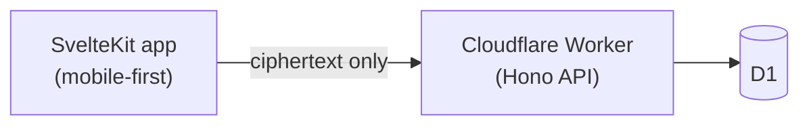

# GitPass

A zero-knowledge password manager with git-like version history — every change to an entry is a new version you can compare and restore, never an overwrite.

The server never has the keys to read your vault. Your master password derives everything client-side; only ciphertext ever reaches Cloudflare. See [docs/CRYPTO_SPEC.md](docs/CRYPTO_SPEC.md) for exactly how.

> **Branches:** this is the `web` branch — the active rewrite (SvelteKit + Cloudflare). The original PHP/MySQL version lives on the [`php`](../../tree/php) branch, unchanged, for reference.

## Stack

SvelteKit (mobile-first) on Cloudflare Pages · Cloudflare Workers (Hono) API · D1 · a shared zero-dependency crypto package. Entirely on Cloudflare's free tier — see [docs/DEPLOYMENT.md](docs/DEPLOYMENT.md) for the exact limits and why this stays $0.



Full architecture, request flow, and data model: [docs/ARCHITECTURE.md](docs/ARCHITECTURE.md).

## Quickstart

```bash
npm install

# terminal 1 — API (local D1, no Cloudflare account needed)
cd api
npx wrangler d1 execute gitpass --local --file=migrations/0001_init.sql
echo "JWT_SECRET=dev-secret-$(openssl rand -hex 16)" > .dev.vars
npm run dev            # http://127.0.0.1:8787

# terminal 2 — web app
cd web
npm run dev            # http://localhost:5173
```

Open `http://localhost:5173`, create an account, save the recovery key it shows you, and add a password. Ready-to-ship deploy steps (real Cloudflare, still free): [docs/DEPLOYMENT.md](docs/DEPLOYMENT.md).

## What's actually working

Registration, sign-in, recovery-key-based password reset, vault CRUD, version history with restore, trash, a password generator, and per-device session management are real and run against a live Worker + D1 — verified end-to-end, not just designed. What's designed but not wired up yet (Favorites, Health check, 2FA, Admin, the browser extension): [docs/FEATURES.md](docs/FEATURES.md).

## Repo layout

```
packages/crypto/   Shared crypto: KDF, HKDF, AES-GCM, hash chain — zero dependencies
api/                Cloudflare Worker API (Hono + D1)
web/                SvelteKit app, mobile-first
docs/               Architecture, crypto spec, deployment, features, the rewrite plan
```

## Testing

```bash
npm test                       # crypto test vectors (packages/crypto)
cd web && npm run check        # svelte-check, full type safety
cd api && npm run typecheck    # Worker type safety
```

## Docs

- [docs/ARCHITECTURE.md](docs/ARCHITECTURE.md) — system, request flow, and data model diagrams
- [docs/CRYPTO_SPEC.md](docs/CRYPTO_SPEC.md) — the key chain and blob format, with test vectors
- [docs/DEPLOYMENT.md](docs/DEPLOYMENT.md) — deploy to Cloudflare's free tier, step by step
- [docs/FEATURES.md](docs/FEATURES.md) — what's built vs. designed
- [docs/WEB_PLAN.md](docs/WEB_PLAN.md) — the original rewrite plan and milestones
- [docs/REDESIGN_PLAN.md](docs/REDESIGN_PLAN.md) — the Figma design system and screen map

## License

See [LICENSE](LICENSE).
