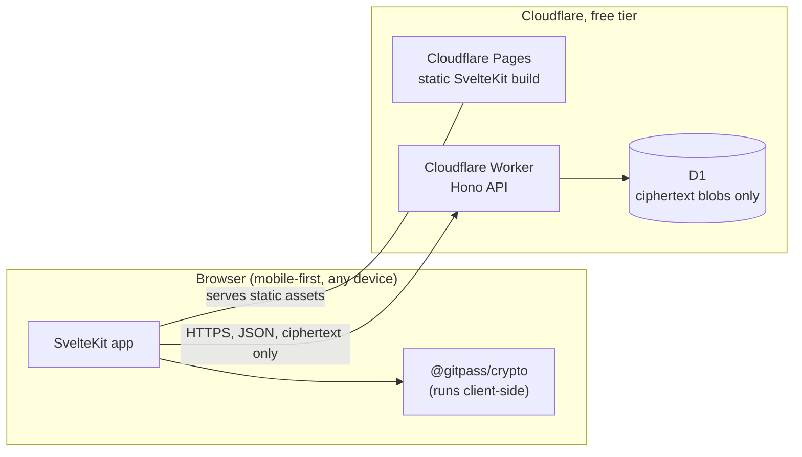
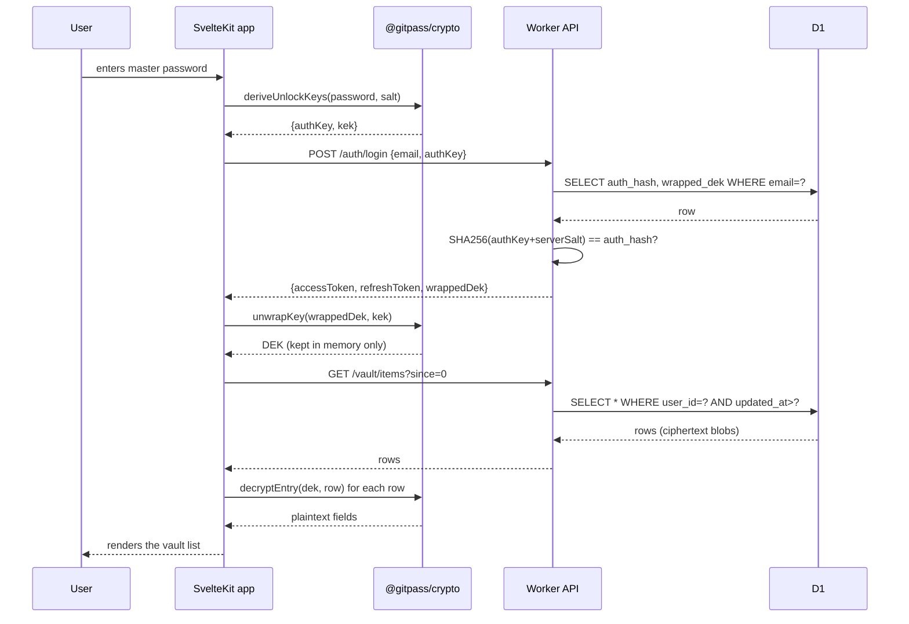
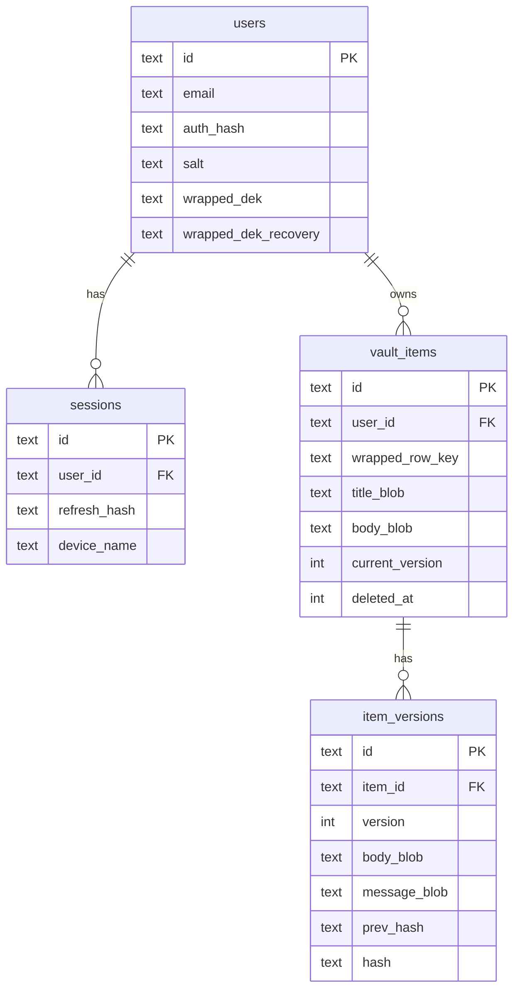

# Architecture

## System



Nothing here costs money at this scale: Pages (unlimited bandwidth), Workers (100k requests/day), D1 (5GB, 100k writes/day). See [DEPLOYMENT.md](DEPLOYMENT.md) for the exact numbers and how to deploy it.

## Request flow: reading the vault



The server (`A`, `D`) only ever handles `authKey` (not the password) and ciphertext blobs. It cannot answer "what does this user's vault contain" even with full database access — see [CRYPTO_SPEC.md](CRYPTO_SPEC.md) for the key chain that makes this true.

## Data model



Every `*_blob` and `wrapped_*` column is ciphertext. `deleted_at` implements Trash (soft delete, 30-day window); `item_versions` implements the git-like history — see [CRYPTO_SPEC.md](CRYPTO_SPEC.md#tamper-evident-history) for the hash chain.

## Code layout

```
packages/crypto/   Zero-dependency Web Crypto wrapper: KDF, HKDF, AES-GCM, hash chain.
                    Shared by web today; by a future extension/mobile client later.
api/                Cloudflare Worker (Hono). Auth, vault CRUD, devices — all D1-backed.
web/                SvelteKit app, mobile-first, adapter-cloudflare (Pages).
docs/               This file, CRYPTO_SPEC.md, DEPLOYMENT.md, FEATURES.md, WEB_PLAN.md.
```

`packages/crypto` has no build step — `web` and `api` both import its `.ts` source directly (Vite and Wrangler each compile TypeScript on the fly), so there's one implementation, not one-per-consumer.

## Why this stack

See [WEB_PLAN.md](WEB_PLAN.md) for the full reasoning (Cloudflare vs. Laravel, PBKDF2 vs. Argon2id, Svelte vs. React). Short version: everything here is free at this scale, and the API is a thin ciphertext blob-store — a job Workers/D1/Hono do natively, with no server to keep warm or pay for.
