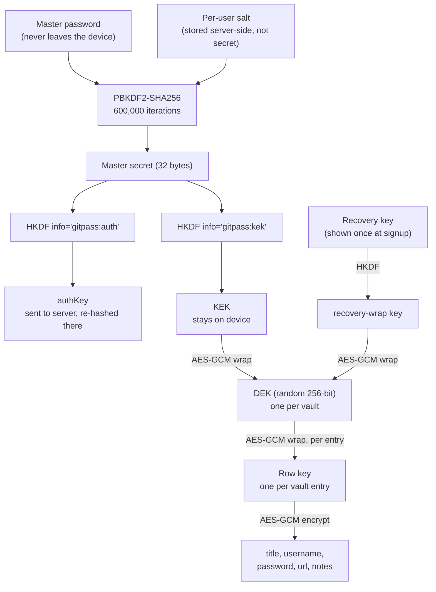

# GitPass crypto spec

The source of truth is [`packages/crypto/src/index.ts`](../packages/crypto/src/index.ts) and its test vectors in [`packages/crypto/test/vectors.test.ts`](../packages/crypto/test/vectors.test.ts) — run `npm test` to verify any implementation (this one or a future mobile/extension port) against them.

## Principle

The server never has the key material to read a vault. Every field that could reveal what an entry is stores only ciphertext; the server only sees ids, timestamps, and byte lengths.

## Key chain



Two independent paths reach the same DEK: the normal password path (`KEK`) and the recovery-key path (`recovery-wrap key`). Either one can unwrap `wrapped_dek` / `wrapped_dek_recovery`; the server stores both blobs but can decrypt neither.

## KDF: PBKDF2, not (yet) Argon2id

The design target is Argon2id. This implementation ships PBKDF2-SHA256 at 600,000 iterations — native to Web Crypto (`crypto.subtle`), zero dependencies, works identically in the browser, a Web Worker, and Cloudflare Workers. `deriveMasterSecret()` is the single swap point: replacing it with an Argon2id WASM call (e.g. `hash-wasm`) changes nothing else in the key chain, since HKDF still treats its output as an opaque 32-byte secret.

## AES-256-GCM blob format

```
version(1 byte) | nonce(12 bytes) | ciphertext + GCM tag(16 bytes), base64-encoded
```

`BLOB_VERSION = 1`. `decrypt()` rejects any other version byte outright.

## AAD binding

Every encrypt/decrypt call passes Additional Authenticated Data built by `fieldAad(userId, entryId, table, column)`, e.g. `"user-1:entry-1:vault_items:password"`. GCM authenticates this string as part of the ciphertext without encrypting it — decryption fails if the blob is moved to a different row, table, column, or user, even with the correct key. This is what stops a server (or an attacker with read access to D1) from silently swapping one user's ciphertext into another user's row.

## Tamper-evident history

Each `item_versions` row stores `hash = SHA256(prev_hash + body_blob)`, version 1 using `prev_hash = ""`. A version's `prev_hash` must equal the previous version's `hash` — anyone with read access to the version list (the owning client) can walk the chain and confirm the server hasn't dropped, reordered, or rewritten history. See `chainHash()` and the "chainHash links versions and breaks on tamper" test.

**Current limitation:** the server itself computes the hash at write time. A fully trustless chain would have the *client* compute and sign each hash before sending it, so a compromised server couldn't fabricate a consistent-looking chain from scratch. That client-side signing is not implemented yet — today this chain proves integrity against accidental corruption and reordering, not against a malicious server. Tracked as follow-up work.

## Test vectors

`packages/crypto/test/vectors.test.ts` uses fixed inputs (`PASSWORD`, `SALT`) so its assertions double as cross-language test vectors — a future Kotlin/Swift/extension implementation should reproduce the same relationships (determinism, independence of derived keys, AAD/key rejection, hash-chain linkage, blob byte layout) from the same inputs.
